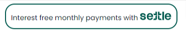
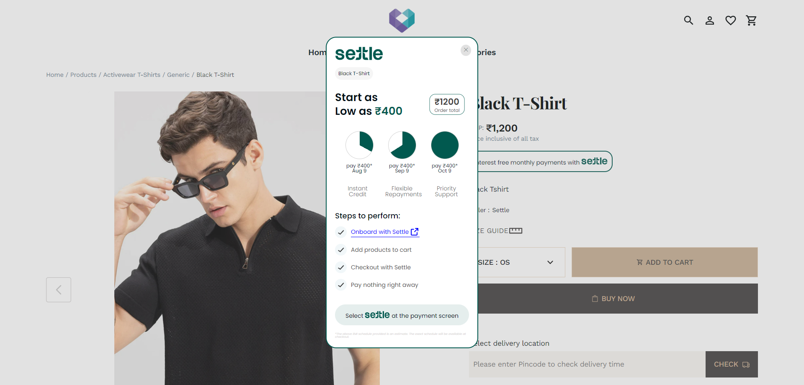
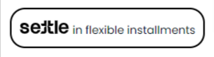
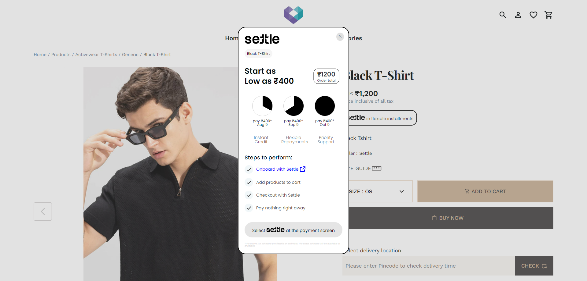

# Aurora Widget

## Adding the Widget

Add this script to your HTML file's `<head>` section:

```html
<script src="https://cdn.pixelbin.io/v2/potlee/original/public/widgets/aurora/settle-widget.js" defer></script>
```

## Implementation

Choose one of these methods to add the widget to your page:

### 1. HTML Element

Simply add this tag where you want the widget to appear:

```html
<settle-widget total-order-value="3000" />
```

### 2. JavaScript Object

Add a container element with the matching selector to your HTML. This element will serve as the placeholder for the widget.

```html
<div id="settle-widget-container"></div>
```

Create a new instance of the `SettlePopupWidget` in your JavaScript. Make sure this script runs after the DOM has fully loaded.

```javascript
document.addEventListener("DOMContentLoaded", () => {
  setTimeout(() => {
    new SettlePopupWidget({
      selector: "#settle-widget-container",
      "total-order-value": "3000",
    });
  }, 1000);
});
```

## Customization

Adjust these attributes to configure your Settle Widget. Each option lets you control the widget's appearance and behavior to best fit your website: (applicable to both implementation methods)

| Attribute                     | Description                                              | Default                             | Options             |
| ----------------------------- | -------------------------------------------------------- | ----------------------------------- | ------------------- |
| total-order-value *`number` | Purchase total amount                                    | 0                                   | -                   |
| selector *`string`          | Container element selector (for Javascript Object only) | #settle-widget-container            | -                   |
| button-text `string`        | Custom button text                                       | Interest free monthly payments with | -                   |
| logo-position `string`      | Settle logo position in button                           | right                               | "left", "right"     |
| theme `string`              | Widget color theme                                       | rgb(1, 89, 79)                      | Any valid RGB color |
| product-name `string`       | Your Product Name                                        | Your Product Name                   | -                   |
| show-product-name `boolean` | Flag for showing product name                            | true                                | -                   |
| currency `string`           | Currency symbol                                          | ₹                                  | -                   |
| emi-tenure `number[]`       | EMI duration in months                                   | [3]                                 | [3, 6, 9, 12]       |
| merchant-id `string`        | Merchant Id to redirect on that page of settle           | -                                   | -                   |

*Required attribues

## Examples

### Default Configuration

```html
<!DOCTYPE html>
<html lang="en">
  <head>
    <meta charset="UTF-8" />
    <meta name="viewport" content="width=device-width, initial-scale=1.0" />
    <title>Default Widget Example</title>
    <script
      src="https://cdn.pixelbin.io/v2/potlee/original/public/widgets/aurora/settle-widget.js"
      defer
    ></script>
  </head>
  <body>
    <settle-widget total-order-value="1200" />
  </body>
</html>
```

#### Result:





### Custom Configuration

```html
<!DOCTYPE html>
<html>
  <head>
    <title>Custom Widget Example</title>
    <meta charset="UTF-8" />
    <meta name="viewport" content="width=device-width, initial-scale=1.0" />
    <script
      src="https://cdn.pixelbin.io/v2/potlee/original/public/widgets/aurora/settle-widget.js"
      defer
    ></script>
  </head>
  <body>
    <div id="settle-widget-container"></div>
    <settle-widget
      "total-order-value"="1200"
      "selector"="#settle-widget-container"
      "button-text"="in flexible installments"
      "logo-position"="left"
      "theme"="rgb(0, 0, 0)"
      "product-name"="Black T-Shirt"
    />
  </body>
</html>
```

#### Result:




