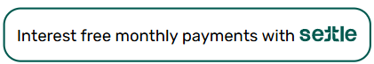
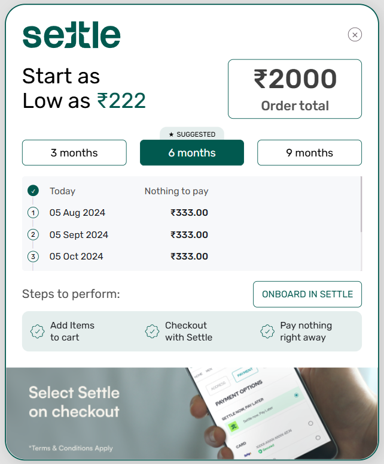
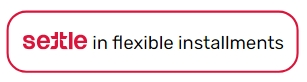
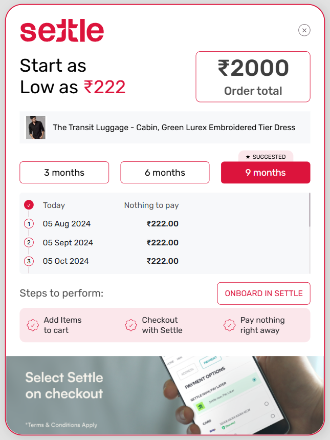

## Adding the Widget

Add this script to your HTML file's `<head>` section:

```html
<script
  src="https://cdn.pixelbin.io/v2/potlee/original/public/widgets/nebula/settle-widget.js"
  defer
></script>
```

## Implementation

Choose one of these methods to add the widget to your page:

### 1. HTML Element

Simply add this tag where you want the widget to appear:

```html
<settle-widget totalOrderValue="3000" />
```

### 2. JavaScript Object

Add a container element with the matching selector to your HTML. This element will serve as the placeholder for the widget.

```html
<div id="settle-widget-container"></div>
```

Create a new instance of the `SettlePopupWidget` in your JavaScript. Make sure this script runs after the DOM has fully loaded.

```javascript
document.addEventListener("DOMContentLoaded", () => {
  setTimeout(() => {
    new SettlePopupWidget({
      selector: "#settle-widget-container",
      total-order-value: "3000",
    });
  }, 1000);
});
```

## Customization

Adjust these attributes to configure your Settle Widget. Each option lets you control the widget's appearance and behavior to best fit your website: (applicable to both implementation methods)

| Attribute                           | Description                                              | Default                             | Options                          |
| ----------------------------------- | -------------------------------------------------------- | ----------------------------------- | -------------------------------- |
| total-order-value\* `number`      | Total purchase amount                                    | 0                                   | -                                |
| selector\* `string`               | Container element selector (for Javascript Object only) | #settle-widget-container            | -                                |
| emi-tenure*`number[]`             | EMI duration in months                                   | [3, 6, 9]                           | [3, 6, 9, 12]                    |
| button-text `string`              | Custom button text                                       | Interest free monthly payments with | -                                |
| logo-position `string`            | Settle logo position in button                           | right                               | "left", "right"                  |
| theme `string`                    | Widget color theme                                       | rgb(220, 20, 60)                    | Any valid RGB color              |
| product-name `string`             | Your Product Name                                        | Your Product Name                   | -                                |
| show-product-name `boolean`       | Flag for showing product name                            | false                               | -                                |
| currency `string`                 | Currency symbol                                          | ₹                                  | -                                |
| show-product-image<br />`boolean` | Flag for showing product image                           | false                               | -                                |
| product-image `string`           | Your product URL                                         | ""                                  | -                                |
| show-suggested `string`           | Flag for showing suggested badge                         | true                                | -                                |
| suggested-month `number`          | Default selected month on opening widget                 | 6                                   | select any month from emi-tenure |

\*Required attribues

## Examples

### Default Configuration

```html
 <!DOCTYPE html>
<html lang="en">
  <head>
    <meta charset="UTF-8" />
    <meta name="viewport" content="width=device-width, initial-scale=1.0" />
    <title>Default Widget Example</title>
    <script
      src="https://cdn.pixelbin.io/v2/potlee/original/public/widgets/nebula/settle-widget.js"
      defer
    ></script>
  </head>
  <body>
    <settle-widget
      emi-tenure= "[3, 6, 9]"
      total-order-value= 2000
     />
  </body>
</html>
```

#### Result:





### Custom Configuration

```html
<!DOCTYPE html>
<html>
  <head>
    <title>Custom Widget Example</title>
    <meta charset="UTF-8" />
    <meta name="viewport" content="width=device-width, initial-scale=1.0" />
    <script
      src="https://cdn.pixelbin.io/v2/potlee/original/settle-widget.js"
      defer
    ></script>
  </head>
  <body>
    <div id="settle-widget-container"></div>
    <settle-widget
      total-order-value= "2000",
      selector= "#settle-widget-container",
      button-text= "in flexible installments",
      logo-position= "left",
      currency= "₹",
      theme= "rgb(220, 20, 60)",
      emi-tenure= "[3, 6, 9]",
      show-product-name= "true",
      show-product-image= "true",
      show-suggested= "true",
      suggested-month= "9",
      product-name= "The Transit Luggage - Cabin, Green Lurex Embroidered Tier Dress",
      product-image= "https://cdn.fynd.com/v2/falling-surf-7c8bb8/fyndnp/wrkr/x5/products/pictures/item/free/resize-w:800/e0r0ygn1e-black-shirt.png",
    />
  </body>
</html>
```

#### Result:




